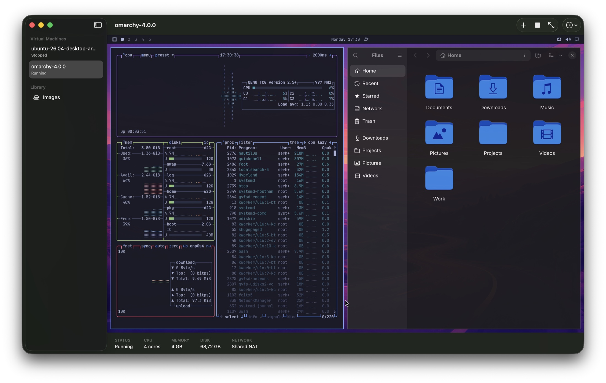

# SimpleVM

<p align="center">
  
</p>

[](https://github.com/serhatandic/SimpleVM/actions/workflows/ci.yml)
[](https://www.apple.com/macos/)
[](LICENSE.md)

SimpleVM is a focused, source-available Linux virtual machine manager for
Apple Silicon Macs. It uses Apple's Virtualization framework for native ARM64
guests and a QEMU/SPICE/Metal path for x86_64 compatibility.

> [!IMPORTANT]
> SimpleVM is currently a `0.1.0` source build. There is no signed DMG or
> notarized binary yet.

## Highlights

- Standard ARM64 EFI ISO installation with near-native Apple Virtualization
- x86_64 full-system emulation with QEMU TCG and a Metal-rendered SPICE display
- Immersive fullscreen that forwards macOS shortcuts and workspace swipes
- Host-derived guest resolution, absolute pointer input, and single-cursor mode
- Managed image imports and downloads with architecture detection and checksums
- Exportable library media and stopped-machine raw disks for migration
- Persistent disks, EFI state, snapshots, restore, and APFS-backed clones
- NAT networking, TCP port forwarding, VZ virtiofs, and QEMU 9p sharing
- Automatic guest audio output on Apple Virtualization and QEMU/SPICE
- First-party, capability-gated SimpleVM Guest Tools for Linux integration
- Rosetta support for Intel Linux binaries in supported ARM64 guests
- Preinstalled raw disks, rootfs archives, and OCI image provisioning

SimpleVM has been exercised with Ubuntu 26.04 ARM64 and Omarchy 4.0 x86_64.
Other standard Linux EFI installers may work, but are not yet part of the
release test matrix.

## Architecture

| Guest | Backend | CPU | Display | Audio output |
| --- | --- | --- | --- | --- |
| ARM64 Linux | Apple Virtualization | Hardware virtualization | `VZVirtualMachineView` | Virtio sound |
| x86_64 Linux | QEMU | TCG software emulation | UTM QEMU, SPICE, CocoaSpice, Metal | Intel HDA over SPICE or Core Audio |

The x86_64 display path is GPU-accelerated, but its CPU remains fully emulated.
It is intended for compatibility and will not match native ARM64 performance.

## Requirements

### Host and toolchain

- Apple Silicon Mac
- macOS 15 or newer
- Xcode with Swift 6.2 or newer
- [XcodeGen](https://github.com/yonaskolb/XcodeGen)
- GNU Make

### Runtime dependencies

- [UTM](https://mac.getutm.app/) installed at `/Applications/UTM.app`
  - Required by the current source build for its QEMU and SPICE frameworks
  - UTM 4.7.5 is the currently validated version
- [QEMU](https://www.qemu.org/) from Homebrew
  - Required for x86_64 disk tooling and the software-display fallback
- [Karabiner-Elements](https://karabiner-elements.pqrs.org/) for reliable
  macOS-style shortcut mapping in native ARM64 immersion

Karabiner-Elements is not required for ordinary windowed input or the QEMU
keyboard path.

## Build from source

```sh
brew install xcodegen qemu
brew install --cask utm

git clone https://github.com/serhatandic/SimpleVM.git
cd SimpleVM
make run
```

`project.yml` is the source of truth for the generated Xcode project.
`make build` also builds and embeds the separately signed rootfs/OCI
provisioning helper.

Every `make` target automatically uses the first available Apple Development
identity so Accessibility permission survives rebuilds, and falls back to
ad-hoc signing when no identity exists. The checked-in Xcode project and CI use
portable ad-hoc signing by default. If you run directly from Xcode, select an
Apple Development identity first to keep Accessibility trust stable. After
switching from an ad-hoc build to a development-signed build, macOS may require
one final approval for the new stable identity.

## Create a machine

1. Open **Images** in the sidebar.
2. Import a Linux EFI installer ISO, or download a catalog image.
3. Choose **New Machine...**, select the image, and configure CPU, memory,
   storage, sharing, and port forwarding.
4. Start the machine and complete the guest installer.
5. Shut the guest down, choose **Eject Installer**, and boot from its
   persistent disk.

Machine state is stored in:

```text
~/Library/Application Support/SimpleVM/
```

VM disks and installer media are intentionally excluded from Git.

### Export and migrate

- In **Images**, open an available image's action menu and choose
  **Export...**. The original media filename is preserved when possible.
- On a stopped machine, open **Machine actions** and choose
  **Export Disk...**. The result is a raw disk that can be brought into
  another SimpleVM installation with **Import Disk**.

Machine exports contain the disk only. CPU, memory, networking, EFI variables,
shares, snapshots, and other machine settings are not included.

## SimpleVM Guest Tools

Guest Tools are optional. VMs boot and remain usable when the agent is absent,
stopped, incompatible, or temporarily disconnected. SimpleVM does not install
software unattended, automate a guest password, or modify a guest disk to
bootstrap the agent.

Open **Guest Tools** in Machine Detail to see connection state, agent and Linux
version, detected desktop/session, shared-folder mount state, and the exact
capabilities advertised by that guest.

### Install

For any existing machine:

1. Start the VM and open **Guest Tools**.
2. If no shared folder is configured, choose **Choose Shared Folder...** and
   restart the VM so SimpleVM can attach the sharing device.
3. Choose **Copy to Shared Folder**. This delivers
   `simplevm-guest-tools.tar.gz`; it does not install it.
4. Run the exact backend-specific command shown by SimpleVM inside the guest.
   For Apple Virtualization it mounts virtiofs:

   ```sh
   sudo mkdir -p /mnt/simplevm-share \
     && (mountpoint -q /mnt/simplevm-share \
      || sudo mount -t virtiofs share /mnt/simplevm-share) \
     && rm -rf "$HOME/simplevm-guest-tools" \
     && mkdir -p "$HOME/simplevm-guest-tools" \
     && tar -xzf /mnt/simplevm-share/simplevm-guest-tools.tar.gz \
      -C "$HOME/simplevm-guest-tools" \
     && cd "$HOME/simplevm-guest-tools/GuestTools" \
     && ./install.sh --with-wayland-clipboard --with-x11-agent
   ```

   QEMU uses its built-in 9p device:

   ```sh
   sudo mkdir -p /mnt/simplevm-share \
     && (mountpoint -q /mnt/simplevm-share \
      || sudo mount -t 9p \
        -o trans=virtio,version=9p2000.L,msize=1048576 \
        share /mnt/simplevm-share) \
     && rm -rf "$HOME/simplevm-guest-tools" \
     && mkdir -p "$HOME/simplevm-guest-tools" \
     && tar -xzf /mnt/simplevm-share/simplevm-guest-tools.tar.gz \
       -C "$HOME/simplevm-guest-tools" \
     && cd "$HOME/simplevm-guest-tools/GuestTools" \
     && ./install.sh --with-wayland-clipboard --with-x11-agent
   ```

You can still choose **Export Tools Bundle...** and move the archive manually.
After moving it, run:

```sh
tar -xzf simplevm-guest-tools.tar.gz \
  && cd GuestTools \
  && ./install.sh --with-wayland-clipboard --with-x11-agent
```

The installer supports modern systemd Debian/Ubuntu and Arch/Omarchy. It asks
for `sudo`, installs a dedicated system service and per-user session service,
and enables them only after validating the required runtime. Sign out and in
once when prompted so the desktop user receives `simplevm-agent` group access.

Optional installer flags install `wl-clipboard` for Wayland and
`spice-vdagent` for supported X11/SPICE sessions. Vanilla `spice-vdagent` does
not provide Hyprland Wayland clipboard integration or Hyprland display resize.

To uninstall, run `./uninstall.sh` from the extracted bundle. The uninstaller
removes the services and agent code but deliberately preserves
`/mnt/simplevm-share` and its contents.

### Supported integration

| Guest/backend | Status and power | Shared folder | Clipboard | Display resize |
| --- | --- | --- | --- | --- |
| Apple VZ, GNOME/X11 | Guest Tools | `share` virtiofs auto-mount | Not currently available | Native VZ fallback |
| Apple VZ, Wayland/Hyprland | Guest Tools | `share` virtiofs auto-mount | Guest Tools with `wl-copy`/`wl-paste` | Guest Tools when Hyprland advertises support |
| QEMU/SPICE, GNOME/X11 | Guest Tools over virtio-serial | `share` 9p auto-mount | SPICE and `spice-vdagent` | SPICE monitor configuration |
| QEMU/SPICE, Wayland/Hyprland | Guest Tools over virtio-serial | `share` 9p auto-mount | Guest Tools with `wl-copy`/`wl-paste` | Guest Tools when Hyprland advertises support |

Clipboard integration is UTF-8 text only and rejects content over 1 MiB.
SimpleVM compares clipboard fingerprints and change counters to suppress echo
loops, does not log clipboard content, and polls only while the app and VM
integration are active. Image, file, and rich-text clipboard formats are not
forwarded.

When a machine uses the **Automatic** desktop and input profile, a connected
agent's detected GNOME or Hyprland desktop selects the active runtime mapping.
An explicit profile selection is never overwritten. Without an agent, the
existing machine-name fallback remains in effect.

### Security model

The host protocol is length-bounded, versioned JSON over QEMU's named
virtio-serial port or Apple VZ AF_VSOCK port 1021. It exposes only status,
graceful shutdown/reboot, fixed `share` mounting, bounded text clipboard, and
validated display-size requests. It has no command-execution request.

Inside Linux, a small root service owns the transport and only invokes fixed
argument arrays for power and mounting the `share` tag through virtiofs or 9p at
`/mnt/simplevm-share`. Desktop clipboard and compositor operations run in an
unprivileged user service. Their Unix socket is group-restricted and validates
peer credentials. See `GuestTools/SECURITY.md` and the Python sources in
`GuestTools/src/` for the complete auditable boundary.

Connection failures are shown in Machine Detail and never prevent VM startup.
Use **Retry Connection** after starting or updating the guest services.

## Immersion and permissions

Immersion removes the surrounding SimpleVM interface and routes host-level
keyboard and workspace input into the guest. The reserved exit chord is:

```text
Control + Option + Command + Escape
```

SimpleVM asks for macOS Accessibility permission when system-level input
capture is needed. That permission allows the app to intercept shortcuts such
as `Command+Tab` and suppress macOS workspace swipes while the guest is
immersive.

For Apple Virtualization guests, SimpleVM can install one app-scoped
Karabiner-Elements rule for reliable virtual-HID modifier delivery. The rule is
active only while SimpleVM immersion is active. SimpleVM does not need
Karabiner-Elements for QEMU guests.

### Hyprland keyboard workflow

For Omarchy and other Hyprland guests:

1. Open the machine's **•••** actions menu.
2. Select **macOS-style Hyprland** under **Desktop and Input Profile**. Machines
   named for Omarchy or Hyprland use this profile automatically unless
   explicitly overridden.
3. In **SimpleVM > Settings**, confirm **System input capture** shows `Ready`. If it does not, use
   **Open Accessibility Settings** and enable SimpleVM.
4. Start the guest and choose **Enter Immersion**. System-level shortcuts and
   horizontal workspace swipes are now routed to Hyprland.
5. Exit at any time with `Control+Option+Command+Escape`.

For **QEMU / x86_64 guests such as Omarchy**, that is the complete setup.
SimpleVM resolves each host chord through its Hyprland profile and sends PC
keyboard scancodes directly through SPICE. Karabiner-Elements is not part of
this path, and **VZ Keyboard Mapping** can be ignored.

The profile provides these host-friendly bindings:

| macOS input | Guest input | Hyprland action |
| --- | --- | --- |
| `Command+Return` | `Super+Return` | Open terminal |
| `Shift+Command+Return` | `Super+Shift+Return` | Open browser |
| `Shift+Command+F` | `Super+Shift+F` | Open file manager |
| `Shift+Command+N` | `Super+Shift+N` | Open editor |
| `Command+Space` | `Super+Space` | Open launcher |
| `Command+J` | `Super+J` | Toggle tiling orientation |
| `Command+Tab` | `Alt+Tab` | Focus next window |
| `Shift+Command+Tab` | `Alt+Shift+Tab` | Focus previous window |
| `Command+Arrow` | `Super+Arrow` | Focus in a direction |
| `Shift+Command+Arrow` | `Super+Shift+Arrow` | Swap in a direction |
| `Control+Command+F` | `Super+F` | Toggle fullscreen |
| `Command+1...0` | `Super+1...0` | Switch workspace |
| Horizontal workspace swipe | Numbered workspace chord | Previous or next workspace |

#### Additional setup for Apple Virtualization

ARM64 Hyprland guests using Apple Virtualization also need
[Karabiner-Elements](https://karabiner-elements.pqrs.org/). Its virtual-HID
keyboard delivers modifiers that `VZVirtualMachineView` does not reliably
accept from synthetic AppKit events.

1. Install and open Karabiner-Elements:

   ```sh
   brew install --cask karabiner-elements
   ```

2. Complete its onboarding prompts. Allow its background services,
   Accessibility access, and DriverKit extension when macOS asks. Karabiner
   15.9 or earlier may also request Input Monitoring.
3. In **System Settings > General > Login Items & Extensions > Driver
   Extensions**, confirm the Karabiner virtual-HID driver is enabled.
4. Relaunch SimpleVM and confirm **VZ Keyboard Mapping** shows
   `Virtual HID ready`.
5. Enter immersion again. SimpleVM creates or updates its app-scoped
   `SimpleVM Immersion Mappings` rule and activates it only for the frontmost
   `com.simplevm.app` session.

Do not add duplicate manual Karabiner rules for the same shortcuts. SimpleVM
backs up `~/.config/karabiner/karabiner.json` before replacing its own scoped
rule, and duplicate mappings can cause repeated keys or stuck modifiers.

If **Virtual HID ready** does not appear, verify that
`Karabiner DriverKit VirtualHIDKeyboard` appears in Karabiner-Elements'
connected devices, then relaunch SimpleVM.
See Karabiner-Elements'
[required macOS settings](https://karabiner-elements.pqrs.org/docs/manual/misc/required-macos-settings/)
for version-specific permission screens.

## Test

Run the platform-independent core suite:

```sh
swift test --package-path Packages/SimpleVMCore
```

Run the deterministic core suite and strict app build:

```sh
make test
```

Run app-hosted integration tests and UI automation separately:

```sh
make app-test
make ui-test
```

The hosted suites require the build dependencies above. XCTest injection can
take several minutes on first launch while macOS validates the external
frameworks. UI tests also require macOS Developer Mode and XCTest automation
approval.

An opt-in hardware smoke test can boot a real ARM64 EFI installer:

```sh
SIMPLEVM_ARM64_ISO_FIXTURE=/absolute/path/to/arm64-installer.iso \
  xcodebuild \
    -project SimpleVM.xcodeproj \
    -scheme SimpleVM \
    -derivedDataPath .build/DerivedData \
    -only-testing:SimpleVMAppTests/FoundationTests/testRealARM64EFIISOStaysRunningWithDisplayAttached \
    test
```

The fixture path and installer image remain local and are never committed.

## Current limitations

- Linux guests only
- Apple Silicon hosts only
- No prebuilt or notarized release artifact
- x86_64 CPU execution uses TCG software emulation
- The accelerated x86_64 build currently expects UTM in `/Applications`
- Guest audio input and host microphone forwarding are not supported
- Guest Tools require an explicit in-guest install and currently target
  systemd Debian/Ubuntu and Arch/Omarchy
- QEMU shared folders use 9p rather than virtiofs and may have lower throughput
  or different POSIX metadata behavior
- System workspace-swipe capture relies on macOS event behavior that may
  change between macOS releases

## License

SimpleVM's original code is available under the
[PolyForm Noncommercial License 1.0.0](LICENSE.md). It is source-available and
free for personal and other noncommercial use. Commercial use requires a
separate license from the copyright holder.

This is not an OSI-approved open-source license. Third-party components remain
under their own licenses; see [Third-Party Notices](THIRD_PARTY_NOTICES.md).

## Contributing

Bug reports and feature requests are welcome through GitHub Issues. To keep
commercial rights centralized, code pull requests are not currently accepted.
See [CONTRIBUTING.md](CONTRIBUTING.md) before opening an issue.

## Acknowledgments

SimpleVM builds on Apple's
[Virtualization framework](https://developer.apple.com/documentation/virtualization),
[UTM](https://github.com/utmapp/UTM),
[QEMU](https://www.qemu.org/),
[CocoaSpice](https://github.com/utmapp/CocoaSpice),
[Karabiner-Elements](https://github.com/pqrs-org/Karabiner-Elements), and
[Apple containerization](https://github.com/apple/containerization).
